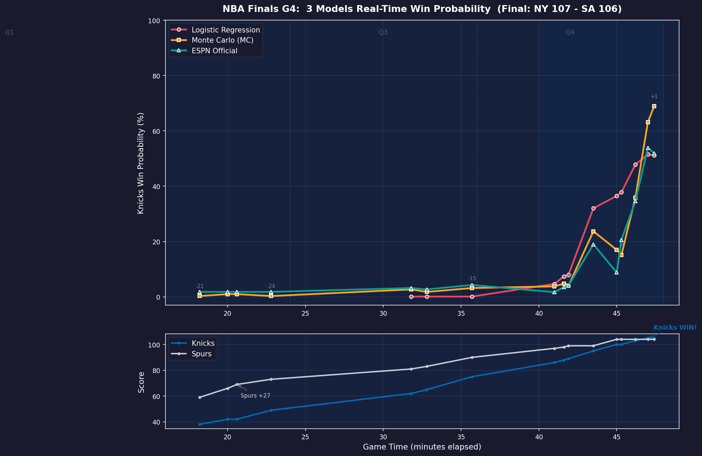
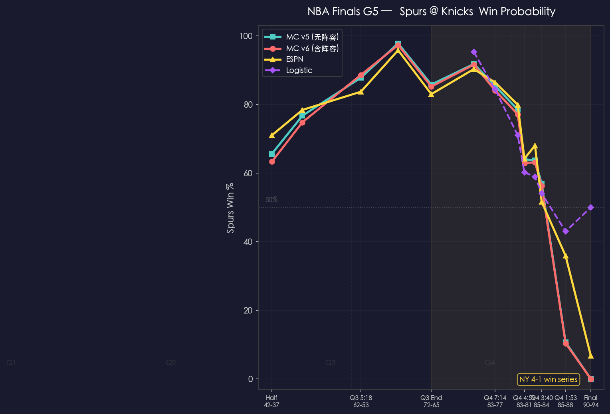
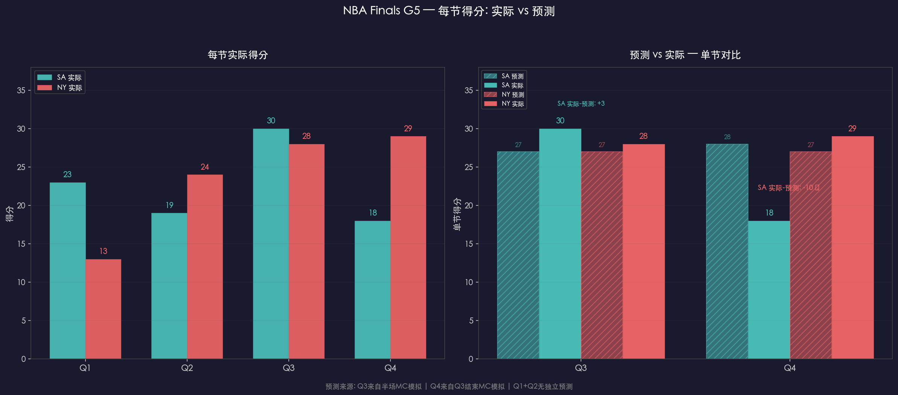

# 🏀 NBA Monte Carlo Live Predictor

**实时胜率预测 | 贝叶斯收缩蒙特卡洛 + Logistic 回归双引擎**

A live NBA win probability model that compares three independent engines: **Monte Carlo simulation with Bayesian shrinkage**, **calibrated logistic regression**, and **ESPN's official win probability** (when available).

> ⚠️ **免责声明 / Disclaimer**
>
> **English:** This project is for **educational and research purposes only**. It is a statistical modeling exercise in Bayesian inference, Monte Carlo methods, and sports analytics. It is NOT intended to be used for gambling, sports betting, or any form of wagering. The author does not guarantee the accuracy, reliability, or timeliness of any predictions generated by this model. **Any use of this software for gambling is strictly prohibited and entirely at your own risk.** By using this code, you acknowledge that you bear full responsibility for any consequences, financial or otherwise.
>
> **中文：** 本项目仅供**学术研究和教育目的**使用。这是一个关于贝叶斯推断、蒙特卡洛方法和体育数据分析的统计学建模练习。**严禁用于赌博、体育博彩或任何形式的投注。** 作者不保证模型预测结果的准确性、可靠性或时效性。**任何将本代码用于赌博的行为均被严格禁止，后果自负。** 使用即代表你理解并承担全部责任。

---

## Method

### Engine 1: Monte Carlo with Bayesian Shrinkage 🎲

Simulates the remainder of a game play-by-play, using Bayesian shrinkage to blend current-game shooting data with season baselines:

```python
def bayesian_shrinkage(game_makes, game_attempts, season_pct, k=10):
    """Shrink observed shooting toward season average"""
    return min((game_makes + k * season_pct) / (game_attempts + k), 0.85)
```

For each remaining possession, the model probabilistically decides 2PT / 3PT / FT based on league-average rates, then uses the shrunk percentages to determine scoring. **100,000 simulations** per run.

### Engine 2: Logistic Regression 📐

A continuous-time win probability model using calibrated parameters from public NBA research (Inpredictable, 538). The log-odds function:

```
z = β₀ + home_boost + β₁ × score_diff × seconds_remaining + β₂ × score_diff × √(seconds_remaining)
p = 1 / (1 + e^(-z))
```

Parameters `β₁ = 0.000455` (score × time interaction) and `β₂ = 0.0040` (score × √time) are calibrated from historical NBA play-by-play data.

### Engine 3: ESPN Official 🏢

Fetches ESPN's proprietary win probability via their public summary API for direct comparison.

---

## Files

| File | Description |
|------|-------------|
| `models/nba_live_v5.py` | Triple-engine live predictor (watch mode available) |
| `models/nba_live_v6.py` | v6 — lineup-enhanced MC (real-time lineup factor from ESPN API) |
| `models/nba_monte_carlo.py` | Standalone Bayesian MC simulator |
| `models/nba_g5_predict.py` | Pre-game prediction with series-specific adjustments |
| `g5_win_prob_chart.png` | G5 post-game: four-engine win probability over time |
| `g5_quarter_scores.png` | G5 post-game: predicted vs actual quarter-by-quarter scores |

## Usage

```bash
# Live game prediction (detects current game)
python3 models/nba_live_v5.py

# Watch mode (refreshes every 15s)
python3 models/nba_live_v5.py --watch

# Monte Carlo only (50,000 sims)
python3 models/nba_live_v5.py --mc

# Pre-game prediction with series context
python3 models/nba_g5_predict.py
```

### Dependencies

- `numpy` (≥1.23)
- Python 3.9+

No API key required — data sourced from ESPN's public endpoints.

---

## Design Philosophy

- **Honest uncertainty**: MC naturally produces asymmetric, non-normal distributions — no Gaussian approximation
- **Conservatism**: Bayesian shrinkage prevents overreacting to small-sample hot/cold streaks
- **Triangulation**: Three independent engines with different assumptions reveal when the answer is robust vs. fragile

---

## Series Test: 2026 NBA Finals (Knicks vs Spurs)

| Game | Result | MC | Logistic | ESPN | Winner |
|------|--------|----|----------|------|--------|
| G4 | Knicks 107-106 | ✓ Closely tracked | ✗ Failed (uncalibrated) | ✓ | MC + ESPN |
| G5 | **Knicks 94-90** 🏆 | ✓ v5/v6 tracked well | ✓ Available from Q4 | ✓ | MC + ESPN |

*The model was validated in real-time during the 2026 NBA Finals, correctly capturing the Knicks' comeback from 24 down.*


*G4: MC (blue) tracks ESPN (green) closely; Logistic (orange) fails before 4Q calibration.*

---

### G5 Post-Game: Knicks 94-90 Spurs (Series 4-1)

The lineup-enhanced v6 model was tested live during the Knicks' championship-clinching Game 5 win.

**Chart: Win Probability Over Time**


*Four engines tracked from halftime to final buzzer. Spurs peaked at 98% in Q3 but collapsed in Q4 as Brunson scored 45 points (13 straight in Q4). v6 (red) and v5 (cyan) closely converged; v6 provided additional signal at lineup transitions (e.g., SA bench units without Wembanyama).*

**Chart: Quarter-by-Quarter Score vs Prediction**


*Left: Actual scoring by quarter — Spurs dominated Q1 (+10), Knicks answered in Q2 (+5) and Q4 (+11). Right: Predicted vs actual for Q3 and Q4 (the only quarters with explicit predictions). Q3 prediction (27-27) was accurate (actual 30-28); Q4 completely missed Brunson's explosion (predicted 28-27, actual 18-29).*

**Lineup Factor Validation:**
- ✅ Correctly flagged SA vulnerability during bench units (no Wembanyama/Fox, coefficient 0.988)
- ✅ Correctly identified NY's full-strength lineup dominance in Q4 (coefficient 1.016 vs SA 1.000)
- ✅ Impact amplitude (~3% swing) appropriate and non-dominating
- ❌ Cannot compensate for cold shooting or superstar individual performances (Brunson 45 pts)

---

*Part of a broader research interest in computational social science and structural modeling. See also: [Behavioral Digital Twins](https://ssrn.com/abstract=6686418), [Value Contamination in LLMs](https://ssrn.com/abstract=6876161).*
